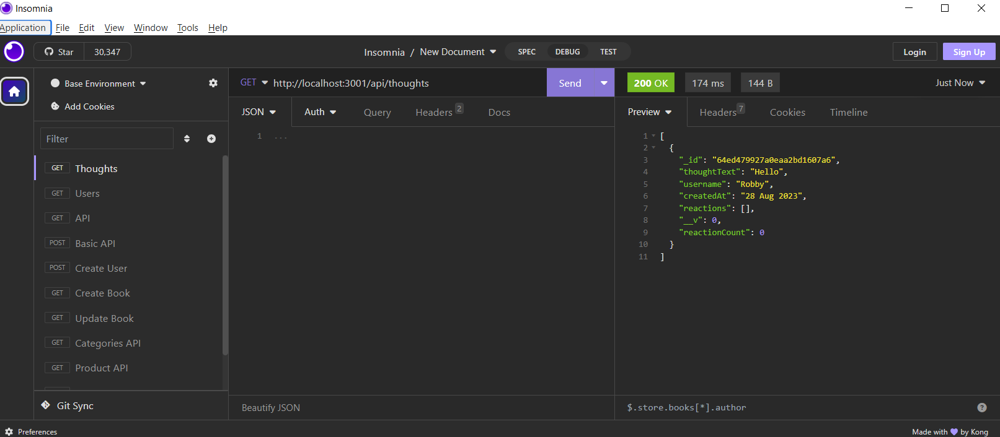
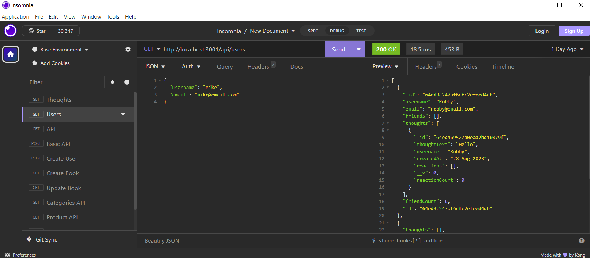

# NoSQL-API-JRMH18

## Description
Using MongoDB for database, I built a web application with API for a social network where users can create a friend list, react to friends’ thoughts, and share their thoughts. I used Express.js for routing, and the Mongoose ODM. In addition, I used the Express.js and Mongoose packages. I created my own data using Insomnia after I’ve created my API. Because this application won’t be deployed, I created a walkthrough video that demonstrates it's functionality and all of the following acceptance criteria being met. 

## Insomnia Screenshots

Thoughts API:

Users API:

## Links

Walkthrough Video: https://watch.screencastify.com/v/clesD5uWHajCSSlw6s1E

GitHub Repository: https://github.com/jzerobby/NoSQL-API-JRMH18
